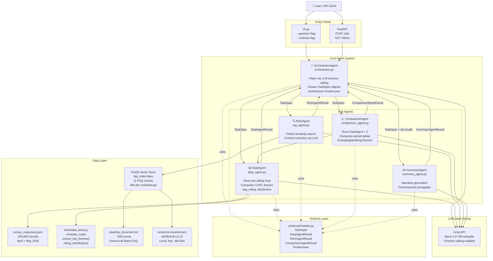
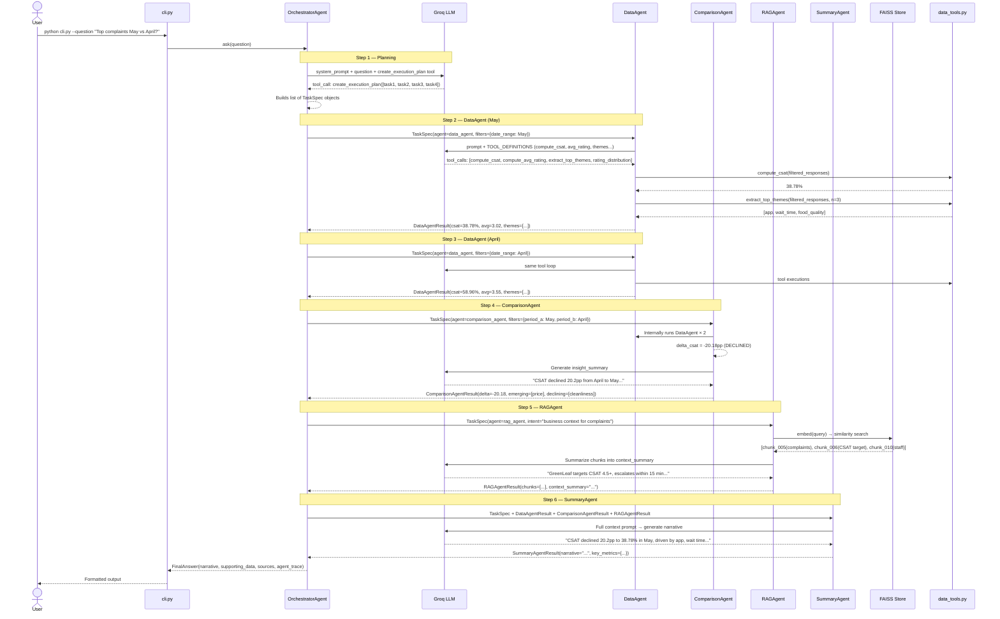
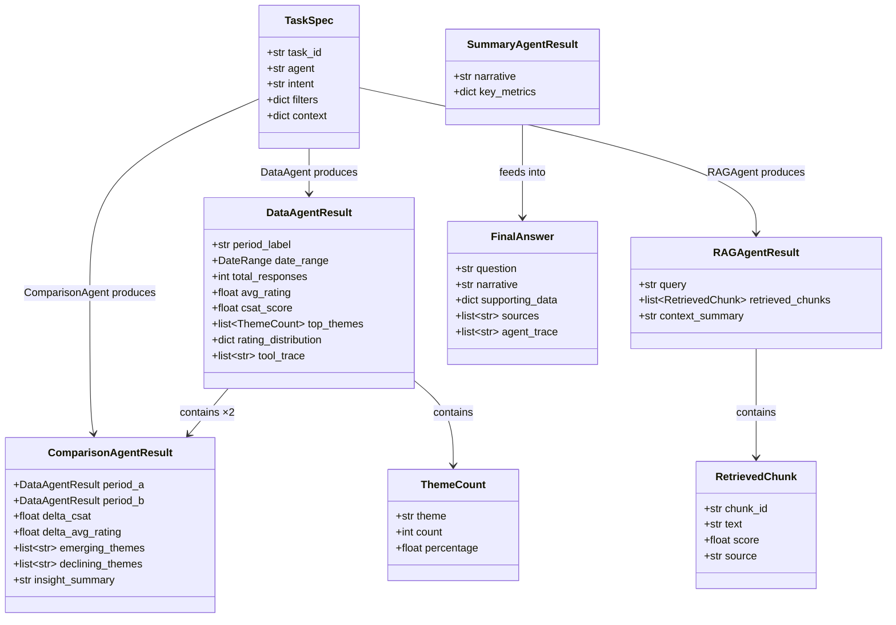
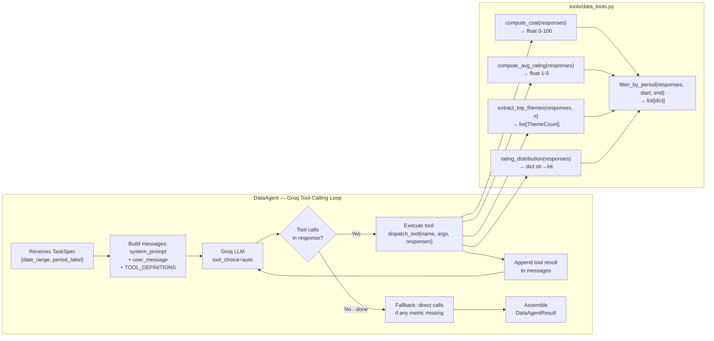
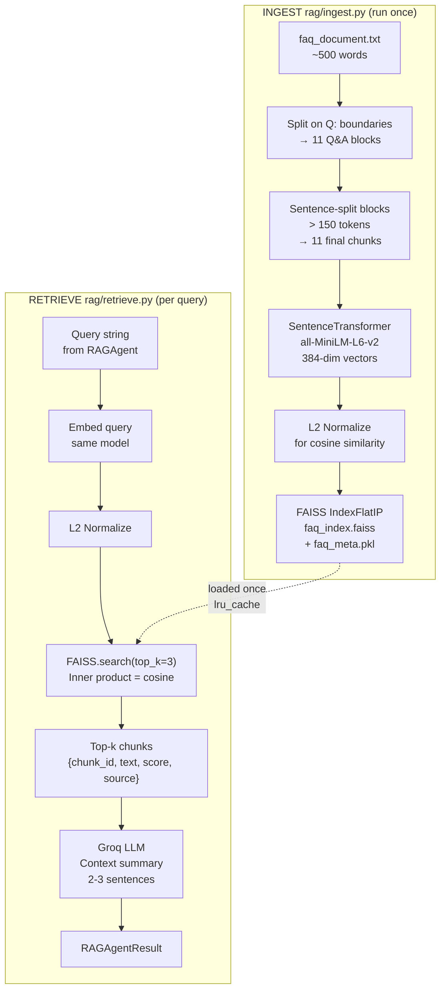
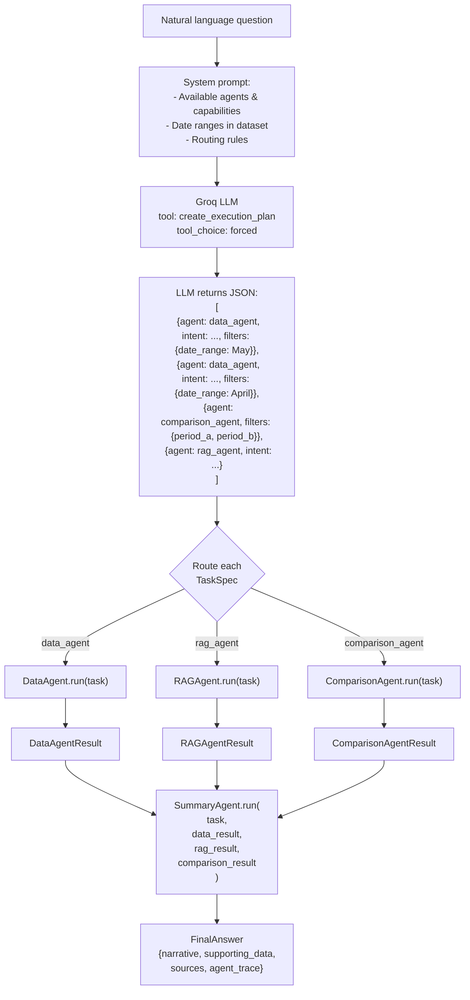
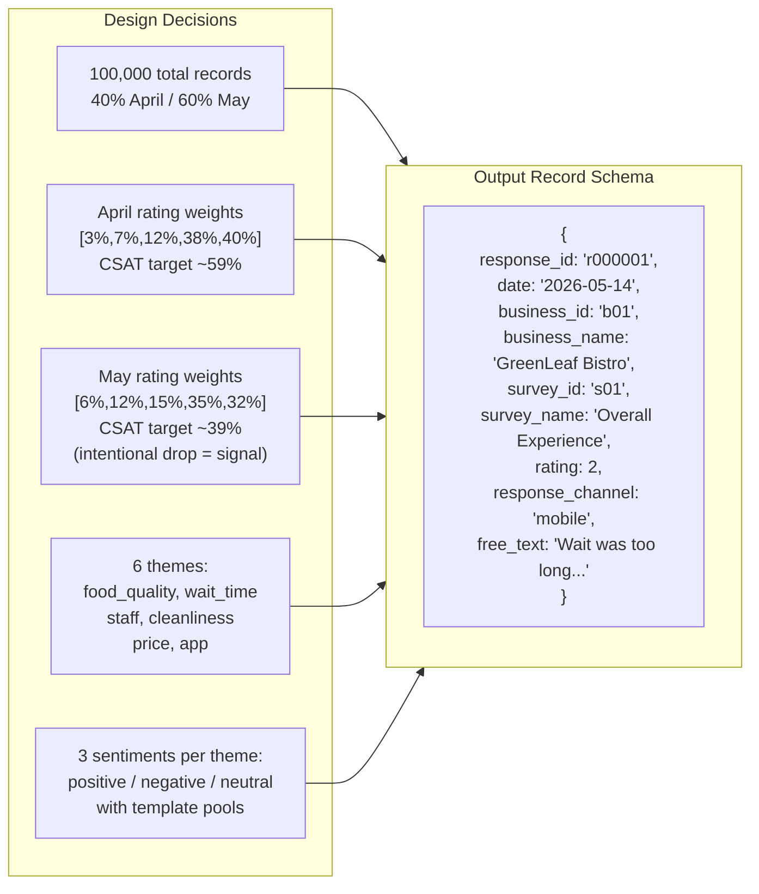
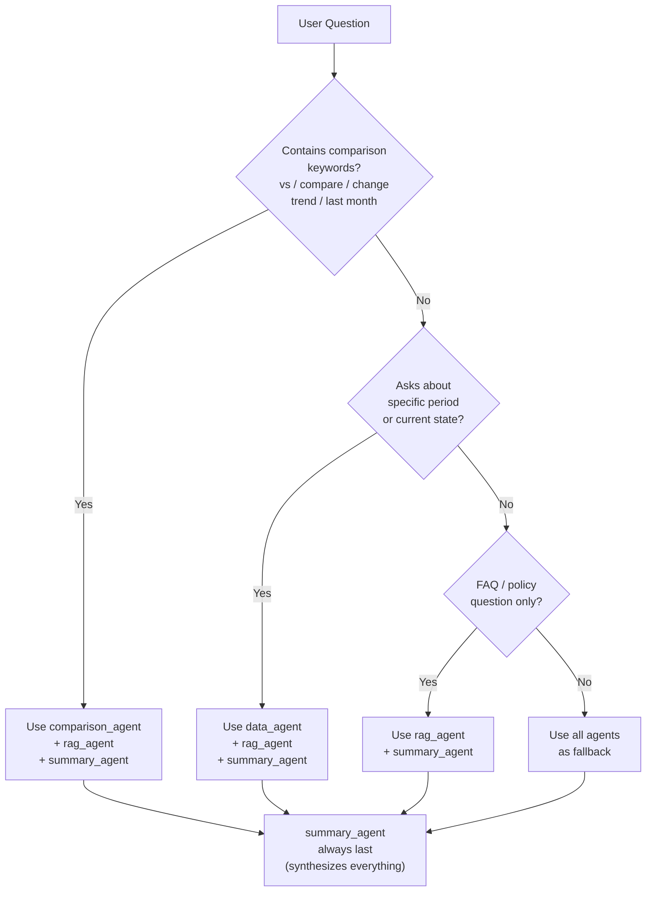
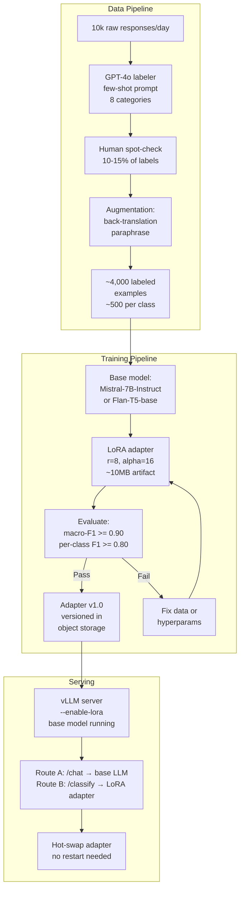
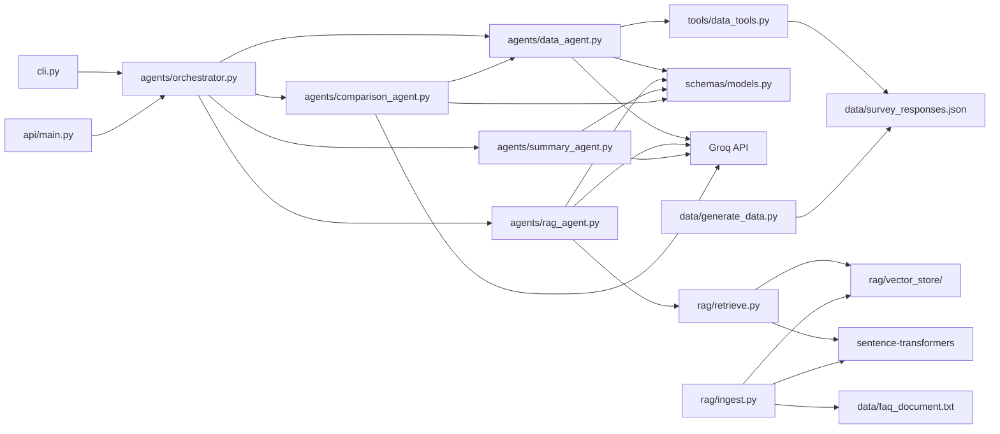

# MiniSense — Architecture Deep Dive

> A complete technical reference for explaining the system in an interview.
> All diagrams are Mermaid — render in any markdown viewer or GitHub.

---

## 1. System Overview

MiniSense is a **two-level multi-agent AI system** that answers natural language business questions about survey data. It combines:

- **Agentic reasoning** (Orchestrator plans, sub-agents execute)
- **Tool calling** (LLM decides what metrics to compute, deterministic functions do the math)
- **RAG** (FAISS vector store grounds answers in business policy)
- **Structured inter-agent communication** (Pydantic models, never raw strings)

---

## 2. High-Level Architecture

---

## 3. Request Lifecycle — Step by Step

---

## 4. Agent Communication Protocol

> **Key design principle**: No agent ever passes or receives raw text. All communication uses typed Pydantic models.

---

## 5. DataAgent Tool-Calling Flow

> This is the core "tool calling from within an agent" the rubric requires.

---

## 6. RAG Pipeline — Ingest & Retrieve

---

## 7. Orchestrator Planning — LLM Function Calling

---

## 8. Data Generation Design

---

## 9. Question Routing Decision Tree

> How the Orchestrator decides which agents to invoke:

---

## 10. Fine-Tuning Architecture (Part 3)

---

## 11. Component Dependency Map

---

## 12. Key Design Decisions — Interview Cheat Sheet

| Decision | What | Why |
|---|---|---|
| **Groq + Llama 3.3 70B** | LLM provider | Function calling support, free tier, already in use |
| **Plain Python (no LangGraph)** | Framework choice | Clean architecture visible, no abstraction hiding agent logic |
| **Pydantic models everywhere** | Inter-agent comms | Enforces structured outputs, type-safe, serializable |
| **Tool calling in DataAgent** | Metrics computation | LLM decides *what* to compute; Python does *how* — deterministic |
| **Q&A block chunking** | RAG strategy | Preserves question-answer semantic units; better than fixed-size |
| **all-MiniLM-L6-v2** | Embedding model | Local, free, 384-dim, strong retrieval, no API cost |
| **FAISS flat index** | Vector store | Zero server infra needed for 11 chunks; HNSW at scale |
| **LRU cache on data load** | Performance | 100MB JSON loaded once, reused across all agent calls |
| **JSON file (no DB)** | Storage | Sufficient at 100k records; scope-appropriate |
| **Two-month dataset** | Data design | Provides comparison signal (April 59% vs May 39% CSAT) |
| **LoRA (not full FT)** | Fine-tuning | 1% trainable params, swappable adapter, no full retraining |
| **vLLM LoRA hot-swap** | Serving | Zero downtime adapter swap, one GPU for multiple routes |

---

## 13. Evaluation Results Summary

| Question | Top Retrieved Chunk | Score | Quality |
|---|---|---|---|
| "What is the CSAT target?" | chunk_006 — CSAT target & escalation policy | 0.5737 | ✅ High precision |
| "How are complaints handled?" | chunk_005 — 15-min escalation, refund policy | 0.4710 | ✅ Correct |
| "Wait time complaints rising?" | chunk_003 — 10min off-peak, 15-20min peak | 0.43 | ⚠️ Partial (app chunk also pulled) |

**Retrieval works well when**: query language matches FAQ Q&A phrasing (direct policy lookups).  
**Retrieval falls short when**: query is implicit or multi-faceted (hybrid BM25 + dense would help at scale).
